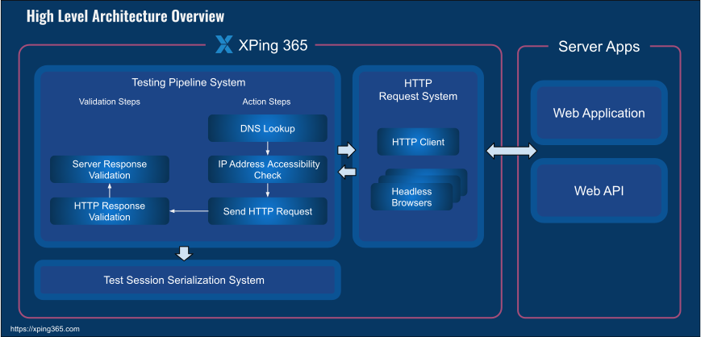

# How does it work?

One of the key features of <b>XPing365</b> is its ability to check server availability through a number of action and validation steps. These steps include:
 
 

##### DNS lookup: 

XPing365 performs a DNS lookup to resolve the domain name of the server to its corresponding IP address. 
 

##### IP address accessibility check: 

XPing365 checks whether the IP address of the server is accessible from the client machine.
 

##### Send HTTP request: 

XPing365 sends an HTTP request to the server to check whether it is up and running.
 

##### Response validation: 

XPing365 validates the response received from the server to ensure that it is valid and contains the expected data.
 

Whenever any of these steps fail, <b>XPing365</b> makes it easy to find out the root cause of the server availability issue. This helps developers quickly identify and fix issues with their web applications.

## High Level Overview

Below figure provides a high-level overview of the XPing365 architecture. 
  

